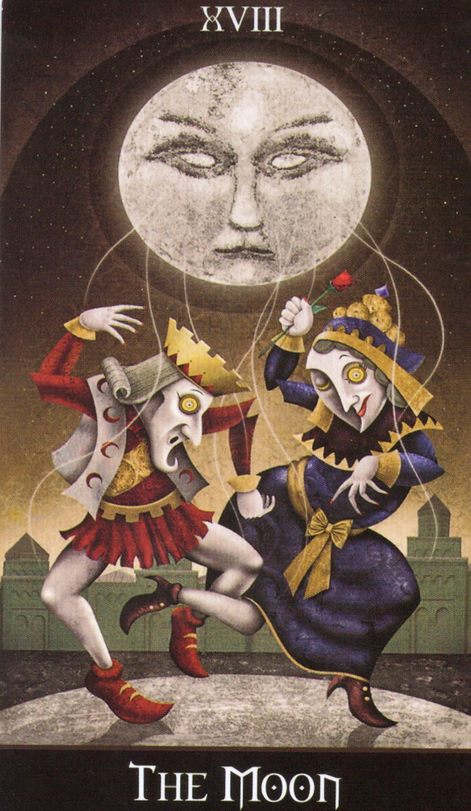

# work_the_moon_hekate.md

## タイトル
**The Lunar Thread: A Meditative Rite of Hekate and Azoth through The Moon**

## 説明（日本語）
この儀式は願望成就を目的としたものではなく、個人的な霊的訓練のための瞑想的ワークです。Deviant Moon Tarot の「The Moon」のカードを焦点とし、そこに描かれた月の顔をヘカテとして捉え、そこから伸びる白い糸をアゾートの流れとして想像します。

アゾートの白い光を通じて、内なる明晰さ・非二元的な意識とつながり、自身の霊的感覚を調律することを目的とします。この体験は、オースティン・オスマン・スペアの唱えた「ナイザー＝ナイザー」の感覚を得るための非二元的な訓練の一形態です。

将来的に公開する可能性もありますが、現時点では非公開・個人用のトレーニングとして設計されています。

---

## 用意するもの
- Deviant Moon Tarot
- The Moon のカード（儀式の中心）
- 白いLEDキャンドル（ヘカテのトーチを象徴）
- 静かな空間（できれば本棚神殿の前）

## Image Reference

---

## 儀式の流れ

### 1. 空間を整える
キャンドルを灯し、「The Moon」カードの後ろまたは横に配置。静かに座り、カードを見つめます。

**詠唱（英語＋日本語訳）**:
> "Oh Hekate of the Silver Face,  
> Weave your thread of white light through my soul,  
> Let me dance in the current of Azoth,  
> And awaken to the clarity behind all duality."
>
> （おお、銀の顔を持つヘカテよ、  
> 白き光の糸を我が魂に通し給え。  
> アゾートの流れの中で我を踊らせ、  
> あらゆる二元を越えた明晰さへと目覚めさせ給え。）

---

### 2. 視覚化
- 月の顔を見つめ、それがヘカテの顔であると感じる。
- そこから伸びる白い糸が自分に結びつく様子を思い描く。
- その糸が自分の感情や思考、夢や記憶を結び、統一しようとしていることを感じる。

---

### 3. 沈黙の瞑想
- 7〜13分ほど静かに座り、内的な気づきを観察する。
- アゾートの存在を白い明晰な光として感じ、空間全体に広がる様子を想像する。

---

### 4. タロットカードを引く（任意）
問い：「今、私の中で踊っているアゾートの質は何か？」
- 1枚引き、そのカードが示す光の質（白・電気紫・黒）を直感で読み取る。
- 日記などに記録する。

---

### 5. 閉式
ヘカテに感謝を伝え、キャンドルを消す。
カードを敬意をもってデッキに戻す。

閉式の言葉（英語＋日本語訳）:
> "As the thread returns to shadow, the light remains within. So mote it be."
>
> （糸が影に戻ろうとも、その光は内にとどまる。然りて然るべし。）

---

## 備考
- 公開用ではなく、完全に個人の訓練用です。
- 儀式内容や文言は、あなたの体験に応じて自由に調整可能。

---

## メタデータ
- 種別：個人用トレーニング儀式
- 関連神格：ヘカテ
- 象徴カード：The Moon（Deviant Moon Tarot）
- アゾートの質：非二元的明晰さ

### 🔍 非二元的明晰さについての補足
アゾートの「非二元的明晰さ」とは、善悪、光闇、成功失敗などの対立を超えた、純粋な気づきの状態を意味します。
これは判断や分析の前に存在する、ただ在る明晰な意識であり、思考が静まり、全てが一つに還元されたような感覚として現れます。これはオースティン・オスマン・スペアが「ナイザー＝ナイザー」と呼んだ非二元論的意識とも響き合うものです。

この儀式では、Deviant Moon Tarot の "The Moon" を通じて、ヘカテの顔から放たれる白い糸をアゾートの流れとして視覚化し、その中で陰陽の踊りを見つめつつ、その背後にある静かな統一意識に触れることを目指します。

非二元的明晰さは、意識が目覚めながらも判断を手放した状態であり、魔術的統合や霊的成長にとって非常に重要な感覚です。
- ステータス：**非公開（Private / Do Not Publish Publicly）**

### 🎨 アゾートの三色についての補足

アゾートには三つの象徴的な色があります。これはジェイソン・ミラーのTSSと複数の伝統的魔術体系からの知見をもとに、アゾートの異なる状態や働きを区別するために使われています。

#### 1. 白（White Azoth）
- **意味**：純粋、静寂、受容、明晰、浄化
- **象徴**：非造化光（Uncreated Light）、仏教のクリアライト
- **用途**：ヒーリング、祈り、内的統合、浄化

#### 2. 電気紫（Electric Violet Azoth）
- **意味**：変容、活性化、直感、エネルギーのスパーク
- **象徴**：雷光、オクタリン（Chaos Magick）、ケネス・グラントのマーヴゾーン
- **用途**：イニシエーション、魔術的変容、アストラルワーク

#### 3. 黒（Black Azoth）
- **意味**：エントロピー、破壊、深淵、還元
- **象徴**：虚無、深い夜、アビス、ブラックホール
- **用途**：内的死と再生、強力な変容、深層瞑想（上級者向け）

これらの色は、アゾートという抽象的な「霊的全体性」を、実践者が異なる文脈や意図に応じてアクセスしやすくするための象徴体系です。視覚・感覚・象徴を通じてアゾートとつながることを可能にします。

アゾートの「非二元的明晰さ」とは、善悪、光闇、成功失敗などの対立を超えた、純粋な気づきの状態を意味します。
これは判断や分析の前に存在する、ただ在る明晰な意識であり、思考が静まり、全てが一つに還元されたような感覚として現れます。

この儀式では、Deviant Moon Tarot の "The Moon" を通じて、ヘカテの顔から放たれる白い糸をアゾートの流れとして視覚化し、その中で王と女王や光と闇といった二元論的な対立が踊りのうちに溶け去り、その背後にある静かな統一意識──すなわちナイザー＝ナイザーに至る意識──に触れることを目指します。
